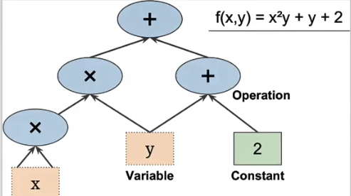
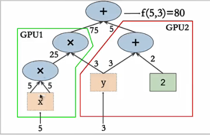
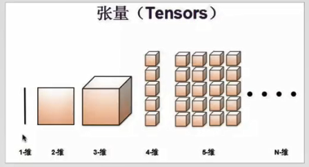

TensorFlow是一个用于训练深度学习模型的强大开源软件库，由Google Brain小组推出；

## 1. 计算图
基本原理是定义一个用来计算的图，然后TensorFlow就会使用这个图进行运算，最后输出结果。

TensorFlow使用的是Python语言，但底层使用C++开发，Python只是做了一层接口而已。


## 2.分解任务：

TensorFlow重要的功能是，分解任务，将一个复杂任务分解成多个相对简单任务，部署到多GPU, 多核，多计算机中执行，最后汇总计算结果。



## 3.TensorFlow实现分布式计算;
TensorFow可以部署到多个计算机；

## 4.TensorFlow特点：

1.跨平台(Windows, Linux, MacOS)

2.提供了TF.learn来兼容sk-learn,  TF.learn是从Scikit-flow(sk-flow)演化过来的。

3.提供了TF-Slim 库简化神经网络的构建，训练和评估；

4.在Tensorflow 之上，建立了很多独立的库，如Keras.

5.通过TensorFlow API, 可以非常灵活地创建任何你能想到的神经网络架构。

6.包含了很多高效的，使用C++实现的机器学习API。特别是用来构建神经网络的API。

7.提供了一个非常强大的称为TensorBoard的可视化工具，可以用来查看计算图，浏览学习曲线。


# TensorFlow基础

TensorFlow由两部分组成，Tensor(张量) 和 Flow(流，计算图)，TensorFlow意为张量在图中流动；

## 1.Tensor(张量)

In TensorFlow, data isn’t stored as integers, floats, or strings. These values are encapsulated in an object called a tensor. 

TensorFlow使用Tensor来表示所有的数据，Tensor可以理解为N维数组或列表。



## 2.Session
TensorFlow’s api is built around the idea of a computational graph, a way of visualizing a mathematical process. Let’s take the TensorFlow code you ran and turn that into a graph:


A "TensorFlow Session", as shown above, is an environment for running a graph. The session is in charge of allocating the operations to GPU(s) and/or CPU(s), including remote machines. 

The code creates a session instance, sess, using tf.Session. The sess.run() function then evaluates the tensor and returns the results.

**Tensor是一个张量，用于存放各种数据，多个Tensor按计算图组织数据关系，sess会话调用run（）执行计算，促使Tensor按计算图流动，得到计算结果，是为Tensor Flow。**

More in : 
https://medium.com/tebs-lab/deep-neural-networks-as-computational-graphs-867fcaa56c9?


## 3.常量


```python
import tensorflow as tf
import os

#os.environ['TF_CPP_MIN_LOG_LEVEL'] = '1' #默认显示所有信息
os.environ['TF_CPP_MIN_LOG_LEVEL'] = '2' # 只显示警告和错误
#os.environ['TF_CPP_MIN_LOG_LEVEL'] = '3' # 只显示错误

hello = tf.constant('hello')
n = tf.constant(99)

print(hello)
print(n)
print(type(hello))
```

    Tensor("Const_12:0", shape=(), dtype=string)
    Tensor("Const_13:0", shape=(), dtype=int32)
    <class 'tensorflow.python.framework.ops.Tensor'>


```python
session = tf.Session()
print(session.run(hello))
```

    b'hello'


```python
print(str(session.run(hello),'utf-8'))
```

    hello


```python
print(session.run(n))
```

    99


### 指定常量的数据类型


```python
str_value = tf.constant('hello tensorflow!', dtype=tf.string)
print(str(session.run(str_value),'utf-8'))
```

    hello tensorflow!


```python

print(session.run(tf.constant(32,tf.int32)))
```

    32


### 常量运算


```python
x = tf.constant(20)
y = tf.constant(60)

session = tf.Session()
add = tf.add(x,y)
sub = tf.subtract(x,y)
mul = tf.multiply(x,y)
div = tf.divide(x,y)
```


```python
print(session.run(add))
print(session.run(sub))
print(session.run(mul))
print(session.run(div))
```

    80
    -40
    1200
    0.3333333333333333


```python
# x*x + x*y + 10
result = x * x + x*y +10
value = tf.constant(20)
print(session.run(result))
```

    1610


## 4.占位符

不指定值，可以重用tensor，必须指定类型；

Tf.placeholder: 传入普通变量，返回一个tensor，tensor用于tf.session.run()。

如果feed_dict与tensor类型不匹配且不能强制转换， you’ll get the error “ValueError: invalid literal for...”.


```python
input1 = tf.placeholder(tf.int32)
input2 = tf.placeholder(tf.int32)

output = tf.add(input1, input2)
session = tf.Session()

# print(session.run(output)) 直接运行，出错
print(session.run(output, feed_dict={input1:2, input2:3}))
print(session.run(output, feed_dict={input1:10, input2:20}))
print(session.run(output, feed_dict={input1:[1,2,3], input2:[2,3,4]}))
```

    5
    30
    [3 5 7]


## 5.变量


```python
x = tf.Variable(2)
y = tf.Variable(3)

f = x*x + y +3

session = tf.Session()
session.run(x.initializer) # 必须调用run, 初始化变量
session.run(y.initializer)
session.run(y)

```


    3


```python
session.run(f)
```


    10


```python
x.load(10,session)
y.load(20,session)
session.run(y)
```


    20


```python
session.run(f)
```


    123


```python
session.close()
```


```python
with tf.Session() as session:
    y.initializer.run()
    x.initializer.run()
    r = f.eval() #
print(r)
```

    10


'''
并不会一下子初始化，而是在计算图中创建一个节点，这个节点会在绘画执行时初始化所有变量
惰性初始化
'''

一个TensorFlow程序分为两部分：
1.用于构建计算图的部分；
2.用于执行计算图部分；


```python
init = tf.global_variables_initializer()
with tf.Session() as sess:
    init.run()
    ret = f.eval() #执行计算图
print(ret)
```

    10


## 6.TensorFlow运算函数

https://www.tensorflow.org/api_docs/python/tf/math


```python
import tensorflow as tf
import os

#os.environ['TF_CPP_MIN_LOG_LEVEL'] = '1' #默认显示所有信息
os.environ['TF_CPP_MIN_LOG_LEVEL'] = '2' # 只显示警告和错误
#os.environ['TF_CPP_MIN_LOG_LEVEL'] = '3' # 只显示错误

x = tf.Variable(10)
y = tf.Variable(20)
z = tf.Variable(-5)

value = tf.Variable(2.5,dtype=tf.float32)
init = tf.global_variables_initializer()

with tf.Session() as session:
    init.run()
    print(session.run(tf.add(x,y)))
    print(session.run(tf.subtract(x,y)))
    print(session.run(tf.multiply(x,y)))
    print(session.run(tf.divide(x,y)))
    print(session.run(tf.mod(x,y)))
    print(session.run(tf.abs(x)))
    print(session.run(tf.negative(x)))
    print(session.run(tf.square(x)))
    print(session.run(tf.sqrt(value))) #不能是整数
    print(session.run(tf.sign(z)))
    print(session.run(tf.sin(value))) #float

```

    30
    -10
    200
    0.5
    10
    10
    -10
    100
    1.5811388
    -1
    0.5984721


### 类型转换

tf.subtract(tf.constant(2.0),tf.constant(1))  # Fails with ValueError: Tensor conversion requested dtype float32 for Tensor with dtype int32: 

保持表达式类型一致，或强制转换

tf.subtract(tf.cast(tf.constant(2.0), tf.int32), tf.constant(1))   # 1

## 7.管理计算图


```python
import tensorflow as tf
import os

#os.environ['TF_CPP_MIN_LOG_LEVEL'] = '1' #默认显示所有信息
os.environ['TF_CPP_MIN_LOG_LEVEL'] = '2' # 只显示警告和错误
#os.environ['TF_CPP_MIN_LOG_LEVEL'] = '3' # 只显示错误

sess = tf.Session()
x1 = tf.Variable(5, name='x1')
sess.run(x1.initializer)

print(tf.get_default_graph().get_operation_by_name('x1'))
print(tf.get_default_graph().get_operation_by_name('x1').get_attr('dtype'))
print(x1.graph is tf.get_default_graph())

#创建一个新计算图
graph = tf.Graph()
with graph.as_default():
    x2 = tf.Variable(20)
    print(x2.graph is graph)

print(x2.graph is tf.get_default_graph())
```

    name: "x1"
    op: "VariableV2"
    attr {
      key: "container"
      value {
        s: ""
      }
    }
    attr {
      key: "dtype"
      value {
        type: DT_INT32
      }
    }
    attr {
      key: "shape"
      value {
        shape {
        }
      }
    }
    attr {
      key: "shared_name"
      value {
        s: ""
      }
    }
    
    <dtype: 'int32'>
    True
    True
    False


## 8.计算图节点的依赖与生命周期


```python
import tensorflow as tf
import os

#os.environ['TF_CPP_MIN_LOG_LEVEL'] = '1' #默认显示所有信息
os.environ['TF_CPP_MIN_LOG_LEVEL'] = '2' # 只显示警告和错误
#os.environ['TF_CPP_MIN_LOG_LEVEL'] = '3' # 只显示错误

k = tf.constant(333)
x = k + 1
y = k + 2
z = x + 5

# 依赖重复计算两次
with tf.Session() as sess:
    print(y.eval())
    print(z.eval())
#依赖只计算一次
with tf.Session() as sess:
    y_val, z_val = sess.run([y,z])
    print(y_val, z_val)
#在计算图每次执行时，所有节点都会被丢弃，但变量不会，变量是由Session维护，除非关闭Session,否则变量一直存在
```

    335
    339
    335 339


```python
'''
数据的归一化和标准化

梯度下降、k邻近
1 - 10   5            0.5

1 - 10000   5000      0.5


代价函数：最新平方误差函数

决策树、随机深林、XGBoost，都不会受特征值范围的影响

缩放数据的方法：归一化（normalization）和标准化（standardization）。

归一化：通过特征的最大最小值将特征缩放到[0,1]区间内。

标准化：通过特征的平均值和标准差将特征缩放成一个标准的正态分布，均值为0，方差为1。

sk-learn（scikit-learn）

'''

# 归一化
import pandas as pd
from sklearn.preprocessing import MinMaxScaler
data = pd.read_csv('./basic/dataset/wine.csv')
print(data.head())
```

       Wine  Alcohol  Malic.acid   Ash   Acl   Mg  Phenols  Flavanoids  \
    0     1    14.23        1.71  2.43  15.6  127     2.80        3.06   
    1     1    13.20        1.78  2.14  11.2  100     2.65        2.76   
    2     1    13.16        2.36  2.67  18.6  101     2.80        3.24   
    3     1    14.37        1.95  2.50  16.8  113     3.85        3.49   
    4     1    13.24        2.59  2.87  21.0  118     2.80        2.69   
    
       Nonflavanoid.phenols  Proanth  Color.int   Hue    OD  Proline  
    0                  0.28     2.29       5.64  1.04  3.92     1065  
    1                  0.26     1.28       4.38  1.05  3.40     1050  
    2                  0.30     2.81       5.68  1.03  3.17     1185  
    3                  0.24     2.18       7.80  0.86  3.45     1480  
    4                  0.39     1.82       4.32  1.04  2.93      735  


```python
minMax = MinMaxScaler()

x_normalization = minMax.fit_transform(data)

print(x_normalization)
```

    [[0.         0.84210526 0.1916996  ... 0.45528455 0.97069597 0.56134094]
     [0.         0.57105263 0.2055336  ... 0.46341463 0.78021978 0.55064194]
     [0.         0.56052632 0.3201581  ... 0.44715447 0.6959707  0.64693295]
     ...
     [1.         0.58947368 0.69960474 ... 0.08943089 0.10622711 0.39728959]
     [1.         0.56315789 0.36561265 ... 0.09756098 0.12820513 0.40085592]
     [1.         0.81578947 0.66403162 ... 0.10569106 0.12087912 0.20114123]]


```python
# 标准化

from sklearn.preprocessing import StandardScaler
std = StandardScaler()

x_std = std.fit_transform(data)
print(x_std)
```

    [[-1.21394365  1.51861254 -0.5622498  ...  0.36217728  1.84791957
       1.01300893]
     [-1.21394365  0.24628963 -0.49941338 ...  0.40605066  1.1134493
       0.96524152]
     [-1.21394365  0.19687903  0.02123125 ...  0.31830389  0.78858745
       1.39514818]
     ...
     [ 1.37386437  0.33275817  1.74474449 ... -1.61212515 -1.48544548
       0.28057537]
     [ 1.37386437  0.20923168  0.22769377 ... -1.56825176 -1.40069891
       0.29649784]
     [ 1.37386437  1.39508604  1.58316512 ... -1.52437837 -1.42894777
      -0.59516041]]


```python

```


```python

```


```python

```


```python

```
