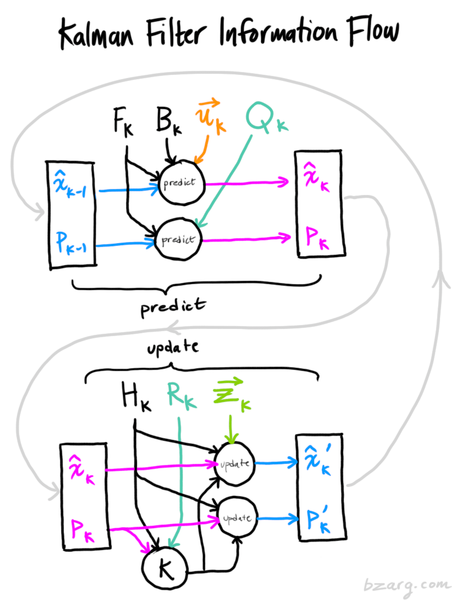
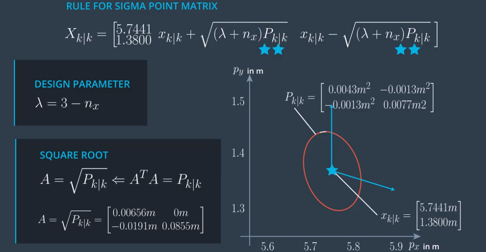

# 无损卡尔曼滤波

在上一节的扩展卡尔曼滤波跟踪系统中，有两个缺陷：

1. 系统采用恒速模型：假定行人沿直线运动；实际应用中，出现曲线运动时，预估不够准确。

2. 每次测量都需要计算雅可比矩阵，很耗资源。

当问题一旦变得复杂，预测和测量模型高度非线性化时，EKF计算量就变得十分不可控，效果表现也较差；

为解决这些问题，学习一个新的状态估计算法--**无损卡尔曼滤波**(Unscented Kalman Filters)

无损卡尔曼滤波基本原理与之前的通用卡尔曼滤波完全一样，还是包括预测和测量更新两部分。不同的是，采取新的运动模型(CTRV)，对非线性化的处理(基于统计采样)。




# 问题1：运动模型

在扩展卡尔曼滤波中，我们用的是恒速模型(constant velocity, CV)，恒速模型是物体追踪中最常见的模型；其他常见的运动模型有：

CTRV：constant turn rate and velocity magnitude model 

CTRA：constant turn rate and acceleration 

CSAV：constant steering angle and velocity 

CCA：constant curvature and acceleration 

在无损卡尔曼滤波中，我们采用CTRV模型，CTRV模型更适合真实的交通场景；


## 1.1 状态向量

CTRV模型的状态向量包括，


General State Vector


$$x = \begin{bmatrix} 
    p_x\\ p_y\\ v\\ \psi\\ \dot{\psi} 
    \end{bmatrix}
$$


$p_x,p_y$: 行人位置

$v$: 速度, 

$\psi$: 偏航角

$\dot{\psi}$: 偏航角速度

## 1.2 过程模型

已知k时刻的状态向量$x_k$，要预测k+1时刻的状态向量$x_{k+1}$, $v_k$是过程噪声:

$$
x_{k+1} = f(x_k, v_k)
$$

方程式中，过程模型f，根据$x_k和v_k的状态，预测x_{k+1}$


###  先实现过程模型确定性部分

由于CTRV模型是非线性的，通用更新方法是

$$
x_{k+1} = f(x_k) + \int_{x_k}^{x_{k+1}}\dot{x}
$$


也即求出状态向量x的微分方程，时间变化dt，就可以利用积分更新过程模型


这是一个非常通用，也非常有用的方法，可以用来推演很多真实世界问题的过程模型。

微分方程如下：


求积分得到过程模型：


它是一个函数，根据k时刻的状态，求出了k+1时刻的状态。这里有个问题，当角速度为0时，会出现除数为0；

这是个正常现象，意味着车辆(或行人)在沿直线运动，把该情景做特殊处理，当$\dot{\psi}$=0时，过程函数简化如下：

$$x_{k+1} = \begin{bmatrix} 
    v_kcos(\psi_k)dt\\ 
    v_ksin(\psi_k)dt\\ 
    v_k\\ 
    \psi\\ 
    0
    \end{bmatrix}
$$

这是过程模型的确定部分，下面求过程模型的随机部分。

### 过程模型随机部分

过程模型的随机部分，用一个二维噪音向量$v_k$描述，不确定性$v_k$由两个独立的标量噪音过程组成：

**直线向加速度噪音$v_a$**： 影响车辆的纵向速度，并且在每个时间步改变它的值；纵向加速度是随机分布的白噪声；

**角加速度$v_{\dot{\dot\psi}}$**:  也是一个均值为0的正态分布白噪声；


假设角加速度和直线加速度，都是常量，将它们添加到过程函数中：


综上，过程模型公式为：

当$\dot\psi \not=0$

$$x_{k+1} = x_k + 
    \begin{bmatrix} 
    \frac{v_k}{\dot\psi_k}(sin(\psi_k + \dot{\psi}dt) - sin(\psi_k))\\ 
    \frac{v_k}{\dot\psi_k}(-cos(\psi_k + \dot\psi_kdt) + cos(\psi_k))\\ 
    0\\ 
    \dot{\psi}dt\\ 
    0
    \end{bmatrix} + \begin{bmatrix} 
    \frac{1}{2}(dt)^2v_{a,k}cos(\psi_k)\\ 
    \frac{1}{2}(dt)^2v_{a,k}sin(\psi_k)\\ 
    dt{\cdot}v_{a,k}\\ 
    \frac{1}{2}(dt)^2{\cdot}v_{\dot{\dot{\psi}},k}\\ 
    dt{\cdot}v_{\dot{\dot{\psi}},k}\\
    \end{bmatrix}
$$

当$\dot\psi =0$，即车辆沿直线运动时，模型公式为
$$x_{k+1} = x_k + 
    \begin{bmatrix} 
    v_kcos(\psi_k)dt\\ 
    v_ksin(\psi_k)dt\\ 
    v_k\\ 
    \psi\\ 
    0
    \end{bmatrix}+ \begin{bmatrix} 
    \frac{1}{2}(dt)^2v_{a,k}cos(\psi_k)\\ 
    \frac{1}{2}(dt)^2v_{a,k}sin(\psi_k)\\ 
    dt{\cdot}v_{a,k}\\ 
    \frac{1}{2}(dt)^2{\cdot}v_{\dot{\dot{\psi}},k}\\ 
    dt{\cdot}v_{\dot{\dot{\psi}},k}\\
    \end{bmatrix}
$$

# 问题2：如何处理非线性模型？

我们已经从CTRV模型中推演出了一个过程模型，这个模型考虑到了直线行驶或拐弯的可能性，这在实际应用追踪自行车时有不错的效果。

这个过程模型，是非线性的。经过非线性转换后，结果已经不是一个高斯分布，一个不规则的分布


EKF的思想是寻找一个线性函数模型来近似这个非线性模型，而UKF的思想是


**预测继续使用高斯分布，寻找一个与真实分布近似的高斯分布**


问题在于，如何才能找到这个均值向量和协方差矩阵？

这个寻找的方法是，无损变换。

使用非线性函数进行整个分布的转换是很难的，但转换状态空间的单个点非常容易。

使用一定方法产生一组代表性sigma point点集，这些sigma point采样点能够代表当前的分布，然后将这些点通过非线性函数变换到一个新的空间（预测空间），

然后基于这些新的sigma point计算出一个新的高斯分布。


现在新的高斯分布，均值和协方差与真正预测的分布相同(可以给出有用的近似)。

值得一提的是，同样的方法也适用于线性案例，如果过程具备线性特征,sigma点方法可以提供和标准通用卡尔曼滤波器一样的解。

但这里最好不要使用sigma点，因为它们计算时间太长

无损预测分三步：


## step1，知道选择sigma点的好办法；


以两个参数为例(便于图示化)


sigma点个数，一般由状态向量维度决定，num=2*n+1

取sigma点方法：


$$X_{k|k} = \Bigg [ x_{k|k} \qquad x_{k|k}+\sqrt{(\lambda+n_x)P_{k|k}} \qquad x_{k|k}-\sqrt{(\lambda+n_x)P_{k|k}} \Bigg]
$$

第一个点就是均值点，

$x_{k|k}+\sqrt{(\lambda+n_x)P_{k|k}}$   表示 $n_x + 1列$

$x_{k|k}-\sqrt{(\lambda+n_x)P_{k|k}}  表示n_x + 2 到 2n_x + 1列$

$\lambda$是一个超参数，$\lambda$越大，sigma point就越远离分布的均值，$\lambda$越小，sigma point越靠近均值。

计算
$$
AA^T = P
$$

求解上式的A是一个复杂的过程，但如果P是对角矩阵，这个求解就可以简化，实际上P表示对估计状态的不确定性(协方差矩阵)，状态空间各分量基本是独立的，也就是说P基本上就是对角矩阵，所以对P进行Choesky分解，得到的下三角矩阵就是A。

代码实现：ex1


过程模型包括两部分，过程噪声也要考虑在内


过程噪声也是一个非线性模型，考虑噪声过程的sigma points用一个增广矩阵表示


代码实现：

ex2

## step2，如何预测sigma点（插入过程函数就可以）;

把step1中产生的sigma points输入过程函数即可:


当$\dot\psi \not=0$

$$x_{k+1} = x_k + 
    \begin{bmatrix} 
    \frac{v_k}{\dot\psi_k}(sin(\psi_k + \dot{\psi}dt) - sin(\psi_k))\\ 
    \frac{v_k}{\dot\psi_k}(-cos(\psi_k + \dot\psi_kdt) + cos(\psi_k))\\ 
    0\\ 
    \dot{\psi}dt\\ 
    0
    \end{bmatrix} + \begin{bmatrix} 
    \frac{1}{2}(dt)^2v_{a,k}cos(\psi_k)\\ 
    \frac{1}{2}(dt)^2v_{a,k}sin(\psi_k)\\ 
    dt{\cdot}v_{a,k}\\ 
    \frac{1}{2}(dt)^2{\cdot}v_{\dot{\dot{\psi}},k}\\ 
    dt{\cdot}v_{\dot{\dot{\psi}},k}\\
    \end{bmatrix}
$$

当$\dot\psi =0$，即车辆沿直线运动时，模型公式为
$$x_{k+1} = x_k + 
    \begin{bmatrix} 
    v_kcos(\psi_k)dt\\ 
    v_ksin(\psi_k)dt\\ 
    v_k\\ 
    \psi\\ 
    0
    \end{bmatrix}+ \begin{bmatrix} 
    \frac{1}{2}(dt)^2v_{a,k}cos(\psi_k)\\ 
    \frac{1}{2}(dt)^2v_{a,k}sin(\psi_k)\\ 
    dt{\cdot}v_{a,k}\\ 
    \frac{1}{2}(dt)^2{\cdot}v_{\dot{\dot{\psi}},k}\\ 
    dt{\cdot}v_{\dot{\dot{\psi}},k}\\
    \end{bmatrix}
$$
注意:

1.输入向量是7维，输出向量是5维的;

2.当角速度为0时，注意除0问题，模型退化成沿直线行驶；

代码实现：
ex3

## step3, 根据预测的sigma点，计算预测、均值和协方差；

计算方法：


### 注意：

对权重$w_i$的定义，方法有多种，这里采用常用的：


Weights: 

$
w_i =\frac{\lambda}{\lambda+n_{a}}, i =1
$

$
w_i =\frac{1}{2(\lambda+n_{a})}, i =2...n_{a}
$

Predicted Mean

$
x_{k+1|k} = \sum_{i=1}^{n_\sigma} w_i X_{k+1|k,i}
$

Predicted Covariance

$
P_{k+1|k} = \sum_{i=1}^{n_\sigma} w_i( X_{k+1|k,i} - x_{k+1|k})(X_{k+1|k,i} - x_{k+1|k})^TP 
$

实现代码：
ex4

现在已经完成过程模型，预测更新


# 测量更新

定义把预测状态转换为测量空间的函数，叫做**测量模型**；

当然，必须考虑是由哪种传感器生成的当前测量值，并使用对应的测量模型(每种传感器有相对应的测量模型)。

当测量模型是非线性时，我们必须采用非线性模型处理，类似于前面介绍的预测更新过程模型。


不过这里有个快捷技巧，可以直接重用预测过程中估计的sigma points，这里还可以跳过扩充步骤，需要扩充是因为过程噪声，
对状态有非线性影响，

比如雷达，测量噪声具有单纯的累加效果，这里不需要扩充，测量噪声，有其他更好的办法？

这里唯一要做的就是把已经有的sigma点转换到测量空间，并使用这些点来计算预测测量值的均值和协方差。


#### 注意：

雷达的状态向量转换到测量空间，只有三个维度。

测量噪声，暂时设置0；

# 计算估计值的均值和协方差

计算方法与前面预测更新部分相似，唯一不同是多出了个测量协方差噪声

这里的测量噪声不具备非线性效应，只是单纯的累计性的，直接使用替换扩充。


Helpful Equations

State Vector
$$
_{k+1|k}=\begin{bmatrix} p_x\\ p_y\\ v\\ \psi\\ \dot{\psi} \end{bmatrix}
$$

Measurement Vector

$$
z_{k+1|k}=\begin{bmatrix} \rho\\ \varphi\\ \dot{\rho} \end{bmatrix} 
$$

Measurement Model

$$
z_{k+1|k}=h(x_{k+1}) + w_{k+1}
$$

$$
\rho = \sqrt{p_x^2+p_y^2}
$$

$$
\varphi =arctan(\frac{p_y}{p_x})
$$

$$
\dot{\rho}=\frac{p_xcos(\psi)v+p_ysin(\psi)v}{\sqrt{p_x^2+p_y^2}} 
$$

Predicted Measurement Mean

$$
z_{k+1|k} = \sum_{i=1}^{n_\sigma} w_i Z_{k+1|k,i}
$$

Predicted Covariance

$$
S_{k+1|k} = \sum_{i=1}^{n_\sigma} w_i( Z_{k+1|k,i} - z_{k+1|k})(Z_{k+1|k,i} - z_{k+1|k})^T + R
$$

$$
R = E(w_k\cdot w_k^T) = \begin{bmatrix} \sigma_{\rho}^2 \qquad 0\qquad0\\ 0\qquad\sigma_{\varphi}^2 \qquad 0\\ 0\qquad0\qquad\sigma_{\dot{\rho}}^2 \end{bmatrix}
$$

代码实现:
ex5

# 计算卡尔曼增益，更新状态空间

最后一步，查看测量值，计算卡尔曼增益，估算新的状态空间和协方差矩阵


更新公式计算方法：


Helpful Equations

Cross-correlation Matrix

$$
T_{k+1|k} = \sum_{i=1}^{n_\sigma} w_i (X_{k+1|k,i} - x_{k+1|k})\ (Z_{k+1|k,i} - z_{k+1|k})^T
$$

Kalman gain K

$$K_{k+1|k} = T_{k+1|k}S^{-1}_{k+1|k}$$

Update State
$$
x_{k+1|k+1} = x_{k+1|k}+K_{k+1|k}(z_{k+1}-z_{k+1|k})
$$

Covariance Matrix Update
$$
P_{k+1|k+1} = P_{k+1|k}-K_{k+1|k}S_{k+1|k}K^T_{k+1|k}
$$

# 参数调节和一致性

最后一个问题，如何选择噪声参数，以及如何评估所选参数效果？

这不仅与无损卡尔曼滤波器相关，同样适用于贝叶斯滤波器。

在过程模型中，我们引入了过程噪声$v_k$, 测量模型中引入了测量噪声$w_k$， 还使用过程噪声协方差矩阵和测量噪声协方差矩阵进行了噪音量化，


这些噪声的的方差，表示噪声的强度，但是这些值是怎么来的呢？

测量噪声描述了传感器测量的精确度，可以从数据手册查看其精度，假设是白噪声，服从高斯分布


选择过程噪声更难些，实际的交通环境里，对象的移动加速度噪声不是白噪音（司机可能不停踩油门和刹车），因此，这里使用强近似，

假设过程噪声是白噪声，要得到有用的值，谨记下面的规则：

尽量估算你在环境中可能碰到的最大加速度，比如城市环境，这些车加速或者刹车的加速度，通常不会超过$6m/s^2$;


选择预期最大加速度的一半作为过程噪声，这个值到底好不好，取决于你的应用，应用对变更的快速反应是不是很重要，如果是，那就选择更高一点的过程噪声。

提供平滑估算是不是很重要，如果是，那就选择更低一点的过程噪音。

你通常需要知道噪音参数设置是否正确，可以运行滤波器一致性检查。

# Consistency: 
NORMALIZED INNOVATION SQUARED(NIS)


在每个循环周期，我们估算测量的均值$Z_{k+1}|k$和协方差矩阵S，实际测量值$z_{k+1}$落在误差椭圆范围内,这是正常的。


但实际可能会出现这样，


低估了预测测量值的不确定性，这说明滤波器是不一致的。估算的精度比你想的要低。

而出现这样，


高估了系统的不确定性，也就是说估算的精度比你想的要高，滤波器是不一致的。

滤波器的一致性，是指能提供真实的估算不确定性。

建议在设计滤波器时，始终检查一致性。检查方法：归一化信息平方，(Normalized Innovation Squared，NIS)


归一化，是指相对于矩阵S的协方差而言

NIS是一个标量数据。

## NIS的统计知识

NIS的分布符合卡方分布，


df：表示自由度，即测量空间的维度；

比如雷达的df=3, 

0.95表示，在统计意义上，所有情况下有95%的概率，NIS会超过0.352；

0.05表示，在所有情况下，有5%的概率，NIS会超过7.815；

设计滤波器时，画出95%这条线，即NIS=7.815，对每个时间步k计算并画出NIS值

如果得到这样的图，是正常的，有时候会超过95%的线


如果得到这样的图


说明系统低估了不确定性。

如果得到这样的图


说明系统高估了不确定性，估算精度比你想的更高。

不幸的时，NIS不会高速你错误原因，但至少它提供了一些反馈信息。

实际测到的雷达NIS一致性检查：


激光NIS一致性检查：(95%线不一样)


如果UKF是一致的，它就能提供真实的协方差矩阵。

UKF还能估算自行车的速度，有没有雷达都可以，如果使用雷达，速度估算收敛的更快。
可以打开关闭两个传感器，看看各自的影响。


还可以估算角速度：


角速度对无人车尤其重要，角速度时最终行为的预测指标。

UKF三个功能：

1.在UKF中，你可以输入噪声测量数据，获得周围动态对象的位置和速度的平滑估算，不会引发延时；

2.即便使用的传感器无法直接观察，还是可以获得其他车辆的方向和速度估算。

3.UKF能给出结果的准确度，因为它能提供每个估算的协方差矩阵；如果UKF已经执行了一致性检查，你就能知道协方差矩阵时真实的。


# Initializing the Kalman Filter

The state vector x contains 
$x = [p_x, p_y, v, \psi, \dot{\psi}]$


$p_x,p_y$:通过传感器测量获得；

For the other variables in the state vector x, you can try different initialization values to see what works best.

注：雷达测量的速度值(无人车视角)，不能直接用来初始化状态空间的速度(CTRV中，速度是自行车的视角，速度与自行车行驶圆周相切);

协方差矩阵，可以初始化为单位矩阵。


# 扩充资源

### Tracking Multiple Objects and Sensor Fusion

The below papers and resources concern tracking multiple objects, using Kalman Filters as well as other techniques!

No Blind Spots: Full-Surround Multi-Object Tracking for Autonomous Vehicles using Cameras & LiDARs by A. Rangesh and M. Trivedi
https://arxiv.org/pdf/1802.08755.pdf


Multiple Sensor Fusion and Classification for Moving Object Detection and Tracking by R.O. Chavez-Garcia and O. Aycard
https://hal.archives-ouvertes.fr/hal-01241846/document


## Stereo cameras

The below papers cover various methods of using stereo camera set-ups for object detection and tracking.

Robust 3-D Motion Tracking from Stereo Images: A Model-less Method by Y.K. Yu, et. al.

http://www.cse.cuhk.edu.hk/~khwong/J2008_IEEE_TIM_Stereo%20Kalman%20.pdf

Vehicle Tracking and Motion Estimation Based on Stereo Vision Sequences by A. Barth (long read)

http://hss.ulb.uni-bonn.de/2010/2356/2356.pdf


## Deep Learning-based approaches

The below papers include various deep learning-based approaches to 3D object detection and tracking.

Fast and Furious: Real Time End-to-End 3D Detection, Tracking and Motion Forecasting with a Single Convolutional Net by W. Luo, et. al.
http://openaccess.thecvf.com/content_cvpr_2018/papers/Luo_Fast_and_Furious_CVPR_2018_paper.pdf


VoxelNet: End-to-End Learning for Point Cloud Based 3D Object Detection by Y. Zhou and O. Tuzel

https://arxiv.org/abs/1711.06396

## Other papers on Tracking Multiple Objects and Sensor Fusion
The below papers and resources concern tracking multiple objects, using Kalman Filters as well as other techniques! We have not included the abstracts here for brevity, but you should check those out first to see which of these you want to take a look at.

Multiple Object Tracking using Kalman Filter and Optical Flow by S. Shantaiya, et. al.
http://www.ejaet.com/PDF/2-2/EJAET-2-2-34-39.pdf

Kalman Filter Based Multiple Objects Detection-Tracking Algorithm Robust to Occlusion by J-M Jeong, et. al.

https://pdfs.semanticscholar.org/f5a2/bf3df3126d2923a617b977ec2b4e1c829a08.pdf


Tracking Multiple Moving Objects Using Unscented Kalman Filtering Techniques by X. Chen, et. al.

https://arxiv.org/pdf/1802.01235.pdf


LIDAR-based 3D Object Perception by M. Himmelsbach, et. al

https://velodynelidar.com/lidar/hdlpressroom/pdf/Articles/LIDAR-based%203D%20Object%20Perception.pdf

Fast multiple objects detection and tracking fusing color camera and 3D LIDAR for intelligent vehicles by S. Hwang, et. al.

https://www.researchgate.net/publication/309503024_Fast_multiple_objects_detection_and_tracking_fusing_color_camera_and_3D_LIDAR_for_intelligent_vehicles

3D-LIDAR Multi Object Tracking for Autonomous Driving by A.S. Rachman (long read)

https://repository.tudelft.nl/islandora/object/uuid%3Af536b829-42ae-41d5-968d-13bbaa4ec736


```python

```
